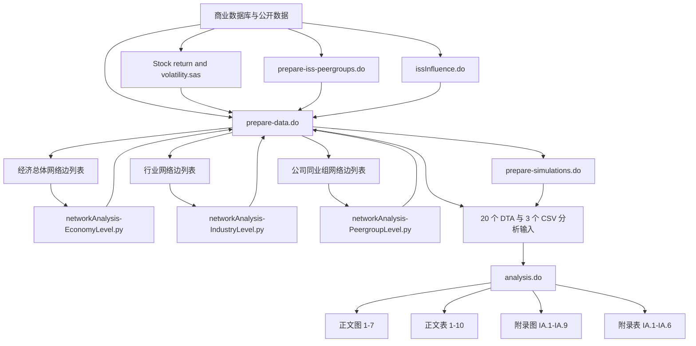

# CEO 薪酬离散度下降：完整复现报告

## 报告导航

1. 论文全文翻译
2. 代码与图表、表格对应关系
3. 代码文件导航与关键逻辑注释
4. 变量说明与注意事项
5. 复现代码流程图
6. 自定义数据复现指南
7. 环境与依赖检查清单

## 复现状态摘要

| 检查维度 | 当前状态 | 说明 |
|---|---|---|
| 论文与附录 | 已完成 | 正文、正式附录及互联网附录共 78 个原稿页 |
| 中文全文翻译 | 已完成 | 纯中文逐句译稿，不展示英文原句 |
| 代码清单 | 已完成 | 5 个 Stata、3 个 Python、1 个 SAS 文件，共 8,114 行 |
| 输入结构审计 | 已完成 | 20 个 DTA、3 个 CSV |
| 作者预生成输出 | 已验证 | 44 个图形 PDF、20 个 TXT、20 个 XLS |
| 本机重新运行 | 未执行 | 当前机器未检测到 Stata |
| 真实结果复现 | 未执行 | 依赖多个商业数据库许可 |

> **总体结论：复现材料结构完整，代码与输出链路可以审计；当前证据支持“结构性复现通过”，但不支持声称真实数据系数已经在本机重新复现。**

## 基本信息

- 论文：Torsten Jochem、Gaizka Ormazabal、Anjana Rajamani，*Why Have CEO Pay Levels Become Less Diverse?*
- 期刊：*The Journal of Finance*，2026
- DOI：<https://doi.org/10.1111/jofi.70050>
- 复现包：`Replication Code-20210355`
- 作者说明文件日期：2025 年 4 月
- 本次审计日期：2026 年 6 月 9 日
- 工作环境：Windows，MatrixEcon 本地工作区

---

# 第一部分：论文全文翻译

## 1.1 翻译范围

中文译稿覆盖：

- 论文标题页、摘要、关键词和披露声明；
- 引言、制度背景、数据、识别策略、实证结果和结论；
- 变量附录与 ISS 薪酬同业选择方法；
- 参考文献；
- Internet Appendix 的轶事证据、图 IA.1–IA.9 和表 IA.1–IA.6。

完整译稿：

> [打开《为什么 CEO 薪酬水平变得不再多样化？》中文全文翻译](/translations/why-have-ceo-pay-levels-become-less-diverse.md)

## 1.2 论文研究问题

论文记录了一个新的典型事实：美国大型上市公司 CEO 薪酬水平的横截面离散度显著下降，主要下降阶段始于 2007 年以后。

作者研究三个相互关联的问题：

1. 薪酬离散度下降是否来自公司构成、经理人特征或股权薪酬计价变化？
2. 公司是否越来越集中地选择行业和规模相近的薪酬同业公司？
3. SEC 薪酬披露规则、ISS 等代理投票顾问以及薪酬方案表决权（SOP），是否推动了薪酬基准比较的标准化？

## 1.3 核心机制

核心解释是“行业-规模基准化”形成薪酬集群。公司围绕行业和规模相近的企业选择同业公司，并以同业薪酬中位数或其他目标百分位数设定 CEO 薪酬。随着同业网络更加互惠和聚集，跨公司的薪酬水平逐渐趋同。

## 1.4 主要识别证据

- 2006 年 SEC 强制披露薪酬同业组之后，薪酬离散度开始明显下降。
- 薪酬同业选择越来越符合 ISS 基于行业和规模的排序方法。
- 在 ISS 同业组规模阈值附近，同业公司入选概率出现不连续变化。
- 公司更可能按照 ISS 建议增加或删除同业公司。
- 被动投资者持股上升与行业-规模基准化增强相关。
- 较低的薪酬方案表决权（SOP）支持率之后，公司同业组更符合行业-规模标准。
- 接近临界结果的薪酬方案表决权（SOP）频率提供了进一步的准实验检验。

## 1.5 翻译质量边界

- 译稿保留论文章节、公式、样本量、系数、显著性标记及正文与附录的完整顺序，不再展示原稿页码标题。
- 复杂回归表存在 12 处原始 PDF 提取顺序需要人工复核的记录。
- 图形坐标轴文本可能受到 PDF 提取顺序影响，精确读数应以原始图形为准。
- 该译稿属于机器辅助学术翻译，不是期刊或作者授权译本。

---

# 第二部分：代码与图表、表格对应关系

## 2.1 总体关系

`prepare-data.do` 负责把原始数据库加工成分析数据集；`analysis.do` 读取这些分析数据集并生成正文与互联网附录中的图表。Python 文件计算同业网络指标，SAS 文件生成股票收益率和波动率变量。

## 2.2 正文图形映射

| 论文输出 | 主要输入 | 生成代码 | 研究内容 |
|---|---|---|---|
| Figure 1 | `sample1.dta`、`sample2.dta` | `analysis.do` | 经济总体、行业-规模组和公司同业组的薪酬离散度 |
| Figure 2 | `figure2.dta` | `analysis.do` | CEO 薪酬倍数分布的变化 |
| Figure 3A | `figure3a.dta` | `analysis.do` | 国际样本比较 |
| Figure 3B | `figure3b.dta` | `analysis.do` | 上市公司与私营公司比较 |
| Figure 4 | 模拟分析数据 | `prepare-simulations.do`、`analysis.do` | 行业-规模基准化下的薪酬离散度模拟 |
| Figure 5 | `sample2.dta` | `analysis.do` | 薪酬同业选择与行业-规模趋同 |
| Figure 6 | `figure6.dta` | `analysis.do` | ISS 排名对同业公司选择概率的影响 |
| Figure 7 | `table10.dta` | `analysis.do` | 接近临界结果的 SOP 投票频率事件研究 |

## 2.3 正文表格映射

| 论文输出 | 主要输入 | 研究内容 |
|---|---|---|
| Table 1 | `sample1.dta`、`sample2.dta` | 描述统计 |
| Table 2 | `sample1.dta`、`sample2.dta`、`table2a-part2.dta` | 薪酬离散度的时间趋势 |
| Table 3 | `sample2.dta`、网络指标 CSV | 同业组构成和网络聚类趋势 |
| Table 4 | `sample2.dta` | 同业组构成与公司层面薪酬离散度 |
| Table 5 | `sample1.dta`、`sample2.dta` | SEC 披露规则与初始合规程度 |
| Table 6 | `table6.dta` | ISS 排名、阈值和同业入选概率 |
| Table 7A | `table7a.dta` | 公司删除同业与 ISS 建议 |
| Table 7B | `table7b.dta` | 公司新增同业与 ISS 建议 |
| Table 8 | `table8.dta` | 被动投资、机构持股和 ISS 影响 |
| Table 9 | `table9.dta` | 较低 SOP 支持率后的同业组调整 |
| Table 10 | `table10.dta` | 接近临界结果的 SOP 投票频率 |

## 2.4 互联网附录输出

- 图 IA.1–IA.6：替代样本、薪酬度量和稳健性图形。
- 图 IA.7：不同薪酬目标百分位数下的扩展模拟。
- 图 IA.8：较大和较小相对规模同业公司的半方差。
- 图 IA.9：经济总体、GICS2、GICS4 和 GICS6 网络聚类。
- 表 IA.1–IA.6：薪酬顾问、同业组规模、行业规模、阈值平衡性和 SOP 稳健性检验。

## 2.5 五项关键分析

### Table 6：ISS 排名分析

因变量是潜在同业公司是否被实际纳入薪酬同业组。模型逐步加入年份、公司、同业公司以及公司×年份和同业公司×年份固定效应。核心目标是检验 ISS 排名及排名阈值是否系统性影响同业公司入选。

### Table 7：ISS 与同业组变更

分别分析公司删除和新增同业公司的行为。关键解释变量表示 ISS 是否建议删除或新增该公司，并控制同业退市、既有 ISS 同业组状态和双方公司特征。

### Table 10 与 Figure 7：SOP 投票频率

样本限制在股东对每年一次和每三年一次 SOP 投票频率支持率差距不超过正负 5 个百分点的公司。模型比较投票前后同业组离散度、行业-规模偏离和 ISS 一致性的变化。

### Figure 5B 与 Table 3B：网络聚类

Python 脚本在经济总体、行业和公司同业组三个层级计算互惠性、密度、传递性、三角形数量和平均聚类系数，再由 Stata 汇总趋势和回归结果。

### Figure 4 与 Figure IA.7：模拟分析

模拟假定公司依据行业和规模规则选择同业公司，并把 CEO 薪酬设定在同业薪酬分布的给定百分位数。分析同时观察薪酬离散度下降和薪酬中位数上升的“薪酬棘轮”现象。

## 2.6 作者预生成输出

复现包包含：

- 图形 PDF：44 个，包括彩色版和灰度版；
- 表格 TXT：20 个；
- 表格 XLS：20 个。

这些文件可以验证输出数量、命名和展示结构，但不能替代本机重新运行产生的结果。

---

# 第三部分：代码文件导航与关键逻辑注释

## 3.1 代码清单

| 文件 | 语言 | 行数 | 主要职责 |
|---|---:|---:|---|
| `analysis.do` | Stata | 2,536 | 生成正文和互联网附录的图表 |
| `prepare-data.do` | Stata | 4,197 | 清洗、链接和构建全部分析数据集 |
| `prepare-simulations.do` | Stata | 432 | 构建行业-规模基准化模拟 |
| `issInfluence.do` | Stata | 313 | 合并 ISS 投票和机构持股，度量投资者追随 ISS 的程度 |
| `prepare-iss-peergroups.do` | Stata | 167 | 按 ISS 公开方法构建合成同业组 |
| `networkAnalysis-IndustryLevel.py` | Python | 129 | 计算行业层面网络指标 |
| `networkAnalysis-PeergroupLevel.py` | Python | 126 | 计算公司同业组层面网络指标 |
| `networkAnalysis-EconomyLevel.py` | Python | 104 | 计算经济总体网络指标 |
| `Stock return and volatility.sas` | SAS | 110 | 构建股票收益率、总波动率和特质波动率 |
| **合计** |  | **8,114** |  |

## 3.2 `analysis.do`

该文件按“FIGURES”和“TABLES”分段：

1. 读取伪数据或真实分析数据；
2. 计算绘图所需的年度均值、分位数和置信区间；
3. 使用 `reghdfe`、`qreg2` 等命令估计模型；
4. 用 `graph export` 输出 PDF；
5. 用 `outreg2` 输出 XLS，并用 `seeout` 生成 TXT。

审计重点：

- 模型通常在公司层面聚类标准误；
- 关键模型吸收行业×规模、行业×年份、公司、公司×年份或同业×年份固定效应；
- 图形同时输出彩色版和灰度版；
- 部分描述统计只输出到 Stata 控制台。

## 3.3 `prepare-data.do`

文件开头直接列出了步骤与目标数据集的对应关系。主要流程包括：

- 构建 ExecuComp 与 Compustat 公司年度样本；
- 链接 CRSP、CCM、治理、薪酬同业和投票数据；
- 计算 CEO 薪酬、异常薪酬和公司特征；
- 构建潜在同业公司配对；
- 生成 Table 6、Table 7、Table 8、Table 9 和 Table 10 专用数据；
- 合并 Python 生成的网络指标；
- 生成已实现薪酬和附录稳健性数据。

该文件是复现链路中依赖数据库最多、迁移风险最高的部分。

## 3.4 网络分析脚本

三个 Python 文件使用 `networkx`，共同计算：

- `reciprocity`：现有连接中双向连接的比例；
- `density`：实际连接占可能连接的比例；
- `transitivity`：三角形相对于连通三元组的比例；
- `triangles`：网络中的三角形数量；
- `clustering`：平均聚类系数。

输出分别按年份、行业-年份或公司-年份保存为 CSV，再合并进入 Stata 数据。

## 3.5 ISS 与 SOP 代码

- `prepare-iss-peergroups.do` 根据行业和相对规模生成 ISS 候选同业排序。
- `issInfluence.do` 把 ISS-NPX 投票与 Thomson Reuters 13F 持股进行链接。
- Table 6 使用 `rank` 和阈值附近的 `rel_rank`。
- Table 7 使用 `dropped_by_ISS`、`added_by_ISS` 等动态变量。
- Table 9 使用 `weakvote` 及事件后年份交互项。
- Table 10 使用 `has1yr`、`post` 和 `has1yrXpost`。

## 3.6 源码逐行解析

已完成全部 9 个源码文件、8,114 行代码的逐行解析。每条记录包含行号、原始代码、所属图表或数据处理模块，以及中文程序逻辑和计量经济学解释。作者源码保持不变。

完整索引：

> [打开图表—代码映射与逐行源码指南](/reports/code-guide/index.md)

网站论文详情页提供按文件选择、关键词搜索和每页 60 行的交互式源码浏览器。

---

# 第四部分：变量说明与注意事项

## 4.1 薪酬变量

| 变量 | 含义 |
|---|---|
| `ceopay` | CEO 报告总薪酬 |
| `ceopay_noopt` | 剔除期权薪酬后的 CEO 薪酬 |
| `tdc1` | ExecuComp 的总薪酬指标 |
| `mom_ceopay_econ` | 以年度中位数缩放的 CEO 薪酬 |
| `mom_ceopay_noopt_econ` | 以年度中位数缩放的不含期权薪酬 |
| `mom_abn_pay_econ` | 年度横截面薪酬回归残差的中位数缩放值 |

## 4.2 离散度变量

| 变量 | 含义 |
|---|---|
| `sd_mom_ceopay_econ` | 缩放后 CEO 薪酬的标准差 |
| `sd_mom_abn_ceopay_econ` | 缩放后异常薪酬的标准差 |
| `sd_rel_at` | 同业公司相对资产账面价值的离散度 |
| `sd_rel_mktval` | 同业公司相对市场价值的离散度 |

## 4.3 同业组变量

| 变量 | 含义 |
|---|---|
| `frac_issPeers` | 实际同业公司中符合 ISS 合成同业组的比例 |
| `frac_atypicalPeers` | 偏离行业-规模标准的同业公司比例 |
| `frac_biLinks` | 双向同业参照比例 |
| `size_peergroup` / `nPeers` | 薪酬同业组规模 |

## 4.4 公司特征

- 资产及实际资产：`at`、`at_real`
- 市场价值：`mktval`
- Tobin’s Q：`tobins_q`
- 销售增长率：`sales_growth`
- 资产收益率：`roa`
- 12 个月股票收益率：`stock_ret_12m`
- 12 个月特质收益波动率：`idio_ret_vol_12m`

## 4.5 网络变量

- `reciprocity`
- `density`
- `transitivity`
- `triangles`
- `clustering`

Python 脚本在无法定义指标或网络没有有效连接时可能写入 `-1`，合并分析前必须确认这些值被正确识别为无效状态，而不是有效的负值。

## 4.6 ISS 变量

| 变量 | 含义 |
|---|---|
| `rank` | 潜在同业公司在 ISS 规则下的排序 |
| `rel_rank` | 相对于 ISS 同业组规模阈值的排序 |
| `isActualPeer` | 是否被公司实际选为薪酬同业 |
| `dropped_by_ISS` | ISS 是否建议删除该同业公司 |
| `added_by_ISS` | ISS 是否建议新增该同业公司 |

## 4.7 SOP 变量

| 变量 | 含义 |
|---|---|
| `weakvote` | SOP 支持率较低的公司指示变量 |
| `postYear1`–`postYear3` | 较低 SOP 投票后的事件年份 |
| `has1yr` | 股东是否选择每年举行 SOP 投票 |
| `post` | 首次 SOP 频率投票后的时期 |
| `has1yrXpost` | 每年投票组与投票后时期的交互项 |

## 4.8 数据许可注意事项

完整流程依赖 Compustat、CRSP、ExecuComp、ISS、Audit Analytics、Equilar、BoardEx、Capital IQ、Refinitiv 或 Thomson Reuters 等数据。不同下载日期、历史回填和链接表版本可能导致样本数量及结果变化。

---

# 第五部分：复现代码流程图



关键顺序是先完成数据准备和网络指标计算，再执行 `analysis.do`。直接运行主分析脚本只能验证已经准备好的 DTA/CSV，不能重建原始数据。

---

# 第六部分：自定义数据复现指南

## 6.1 建议目录

```text
replication/
├─ raw/
│  ├─ compustat/
│  ├─ crsp/
│  ├─ execucomp/
│  ├─ iss/
│  └─ governance/
├─ intermediate/
├─ analysis-data/
├─ code/
├─ output/
│  ├─ figures/
│  ├─ tables/
│  └─ logs/
└─ environment/
```

不要直接修改作者复现包。应复制到独立运行目录，并把原始数据、临时数据和最终输出分离。

## 6.2 核心数据要求

### ExecuComp

至少需要公司标识、财政年度、CEO 标识、TDC1、股票授予、期权授予、已实现薪酬相关字段。

### Compustat

至少需要 GVKEY、财政年度、资产、销售额、权益市场价值、盈利能力、现金、债务、研发和资本支出等字段。

### CRSP

至少需要 PERMNO/PERMCO、日期、股票收益率、价格、流通股和市场收益率。

### 薪酬同业数据

需要被评估公司、同业公司、披露年度和同业关系来源。多个供应商数据必须统一公司标识和财政年度。

### ISS 与机构持股

需要 SOP 投票、SOP 频率投票、ISS 建议、机构持股和基金分类。

## 6.3 建议执行顺序

1. 固定数据库下载日期并保存字段字典。
2. 运行 SAS 脚本生成股票收益率和波动率。
3. 构建 ISS 合成同业组。
4. 生成投资者追随 ISS 的指标。
5. 运行 `prepare-data.do` 的基础样本步骤。
6. 导出三类网络边列表。
7. 运行三个 Python 网络脚本。
8. 把网络 CSV 合并回 Stata。
9. 运行模拟脚本。
10. 生成全部分析数据集。
11. 运行 `analysis.do`。
12. 比较文件数量、文件哈希、样本量、系数和图形。

## 6.4 输出验证

每次运行应记录：

- 输入文件哈希；
- 数据库下载日期；
- 软件和扩展命令版本；
- 每个步骤的开始与结束时间；
- 每个中间数据集的观测数和变量数；
- 最终 PDF、TXT 和 XLS 的文件数量；
- 与作者预生成输出的差异。

## 6.5 伪数据的正确用途

伪数据可以用于：

- 验证路径和变量名；
- 验证脚本是否能进入主要分析模块；
- 检查图表输出命名；
- 检查依赖命令是否缺失。

伪数据不能用于：

- 验证论文系数；
- 判断经济显著性；
- 重现论文图形走势；
- 宣称研究结论已复现。

---

# 第七部分：环境与依赖检查清单

## 7.1 Stata

建议使用 Stata MP 17 或 18。主要扩展命令包括：

```stata
ssc install reghdfe
ssc install ftools
ssc install outreg2
ssc install winsor2
ssc install distinct
ssc install estout
```

`qreg2` 和 `seeout` 还需要根据作者环境确认安装来源及版本。

运行前检查：

```stata
about
which reghdfe
which outreg2
which winsor2
which distinct
which qreg2
which esttab
which seeout
```

## 7.2 Python

网络分析需要：

- Python 3
- `numpy`
- `pandas`
- `networkx`

作者代码注释引用了较早的 NetworkX 文档。新版本 NetworkX 的部分函数行为可能变化，因此应记录实际版本并用小样本验证指标。

## 7.3 SAS 与 WRDS

股票收益率和波动率准备依赖 SAS/WRDS 环境。应验证：

- WRDS 连接和账户权限；
- CRSP 与 CCM 链接表；
- 日期范围和退市收益处理；
- 市场模型或因子模型估计窗口；
- 输出标识能否与 Stata 数据合并。

## 7.4 硬件与存储

- 伪数据约 2.5GB。
- `table7b.dta` 约 1.22GB，`sample2.dta` 约 796MB。
- 模拟步骤可能生成超过 5GB 的临时文件。
- 建议至少预留 20GB 可用空间，并使用 16GB 以上内存。

## 7.5 当前机器检查结果

| 项目 | 状态 |
|---|---|
| 复现包可读 | 通过 |
| 9 个代码文件可读 | 通过 |
| 20 个 DTA 和 3 个 CSV 存在 | 通过 |
| 44 个图形 PDF 可读 | 通过 |
| 20 个 TXT 和 20 个 XLS 可读 | 通过 |
| Stata | 未检测到 |
| `analysis.do` 本机执行 | 未执行 |
| 商业数据库访问 | 未验证 |

---

# 复现评级与结论

| 维度 | 评级 |
|---|---|
| 材料完整性 | 高 |
| 代码组织 | 高 |
| 图表输出覆盖 | 高 |
| 执行说明 | 较高 |
| 环境可移植性 | 中 |
| 无商业数据的结果复现能力 | 低 |
| 伪数据下的结构验证能力 | 高 |
| 当前机器的真实运行证据 | 暂无 |

**最终评级：材料充分、数据和代码链路清楚，适合开展结构审计和伪数据执行验证；真实结果复现仍取决于 Stata 环境、商业数据许可、历史数据库版本和完整运行日志。**
