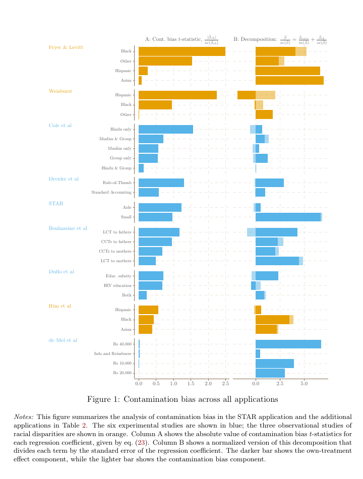
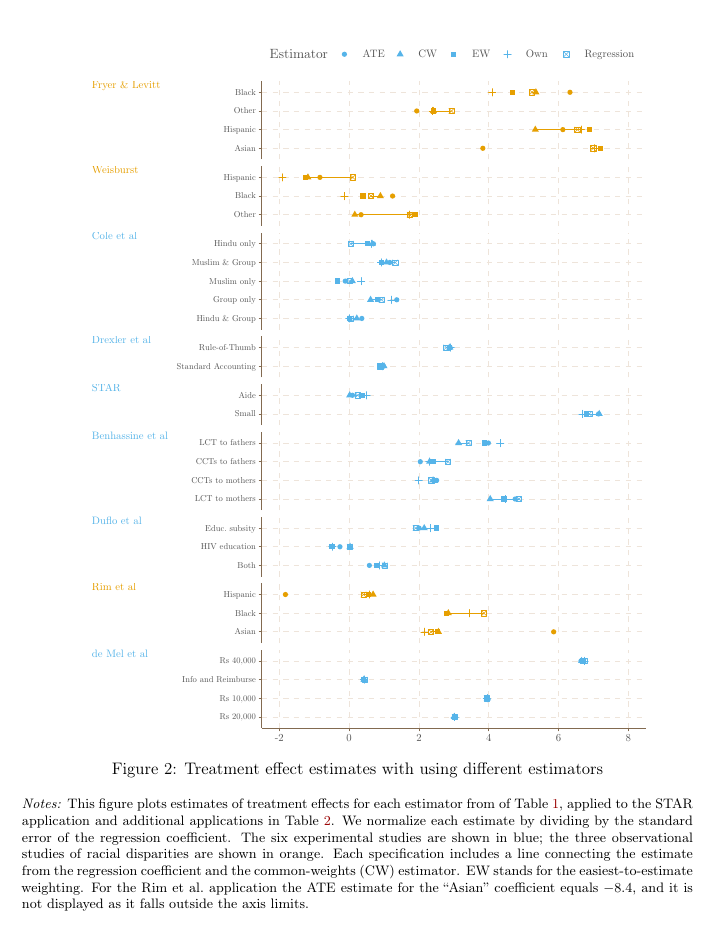

# 《线性回归中的污染偏误》复现报告

> Goldsmith-Pinkham, Paul, Peter Hull, and Michal Kolesár. 2024. *Contamination Bias in Linear Regressions*. 2024 年 6 月 21 日版本。

## 1. 复现结论

本次复现完成了论文材料盘点、理论与代码映射、作者官方 `multe` 软件包源码审计，以及 Project STAR 基准部分线性回归的本地真实数据核验。

**核心结论：**

1. 当回归同时包含多个互斥处理变量和灵活控制变量时，某一处理变量的 OLS 系数一般不仅加权其自身的异质性处理效应，还会混入其他处理的效应。后者即“污染偏误”。
2. 污染偏误不是传统遗漏变量偏误。即使控制变量足以消除遗漏变量偏误，其他处理效应仍可能通过均值为零但具有正负值的交叉处理权重进入目标系数。
3. 作者提出三类无污染估计方案：交互回归 ATE、逐处理的最易估计权重 EW，以及允许处理间比较的共同权重 CW。
4. 本地使用作者仓库中的 `example_star.dta`，精确复核了 Table 1 第（1）列的 Project STAR 基准回归。小班和助教处理的系数、异方差稳健标准误均与论文报告值在三位小数上完全一致。
5. 作者没有提供一键生成论文全部表图的统一复现包。官方 R/Stata 仓库是方法软件包，附带 Project STAR 和 Fryer–Levitt 示例数据；其余七项应用的原始复现材料仍需分别从 AEA Data and Code Repository 获取。
6. 当前机器没有安装 R 或 Stata，因此 `OWN / ATE / EW / CW` 的官方实现及软件包单元测试尚未在本机执行。相关数值目前属于“作者预生成结果核对”，不能标记为本地复现成功。

## 2. 复现状态

| 模块 | 状态 | 证据 |
|---|---|---|
| PDF 完整性与结构审计 | 已完成 | 70 页；正文、附录、公式和表图均可提取 |
| 作者官方 R 实现 | 已获取并审计 | `multe`，版本 `1.1.0.9000`，提交 `3731a180...` |
| 作者官方 Stata 实现 | 已获取并审计 | `multe`，版本 `1.1.0`，提交 `89656e373...` |
| Project STAR 基准 PL 回归 | **本地真实运行成功** | \(N=5{,}868\)，结果与 Table 1 第（1）列一致 |
| Project STAR OWN/ATE/EW/CW | 作者结果与源码已核对，未本地运行 | 缺少 R/Stata 运行环境 |
| Fryer–Levitt 示例 | 数据和官方预期结果已获取，未本地运行 | 缺少 R/Stata 运行环境 |
| 其余七项应用 | 未复现 | 原始应用数据与各论文清洗脚本未随 `multe` 发布 |
| Figure 1–2 | 结论与数据来源已映射，未重新生成 | 需要九项应用的完整结果集 |
| Appendix C/D | 结构与结果已审计，未重新生成 | 同上 |

## 3. 材料清单

### 3.1 论文

- 工作区副本：`inputs/paper/contamination-bias/Contamination Bias in Linear Regressions.pdf`
- 页数：70
- 文件大小：1,083,451 bytes
- SHA-256：`0BDD5CBD5F2C05FFDF3D279B1B32222B5C1632F90670566CB061A313CBA98A8D`

### 3.2 官方方法代码

| 语言 | 仓库 | 核心入口 | 示例数据 |
|---|---|---|---|
| R | `inputs/replication/contamination-bias/multe-r` | `R/multe.R`、`R/functions.R` | `data/fl.rda` |
| Stata | `inputs/replication/contamination-bias/multe-stata` | `src/ado/multe.ado`、`src/mata/multe.mata` | `test/example_star.dta`、`test/example_fryer_levitt.dta` |

Project STAR 示例数据 SHA-256：

`E4F2F674A7B8BD814A9CAAE8EBC3FDF4C65E2FC6CD4BD1167E96DE523CC22078`

Fryer–Levitt 示例数据 SHA-256：

`C47264D8A969CC9C4FBC3E39F41E96FD45FFD8F6F44DC40CF1526D65600BD5A2`

## 4. 研究问题与贡献

论文研究一个常被忽略的问题：当一个回归模型同时放入多个处理指标时，每个处理系数究竟在平均谁的处理效应？

对于单一二元处理，在处理概率模型被控制变量正确张成时，OLS 系数可以解释为条件平均处理效应的凸加权平均。论文证明，这一结论通常不能推广到多个互斥处理。目标处理 \(k\) 的系数为：

$$
\beta_k
=
\mathbb{E}\!\left[\lambda_{kk}(W_i)\tau_k(W_i)\right]
+
\sum_{\ell\neq k}
\mathbb{E}\!\left[\lambda_{k\ell}(W_i)\tau_\ell(W_i)\right].
$$

其中：

$$
\mathbb{E}[\lambda_{kk}(W_i)]=1,
\qquad
\mathbb{E}[\lambda_{k\ell}(W_i)]=0.
$$

第一项是目标处理自身效应的加权平均；第二项由其他处理的异质性效应构成，是污染偏误。因为交叉处理权重的均值为零，污染偏误也可以写成：

$$
\mathbb{E}[\lambda_{k\ell}(W_i)\tau_\ell(W_i)]
=
\operatorname{Cov}\!\left(
\lambda_{k\ell}(W_i),
\tau_\ell(W_i)
\right).
$$

因此，污染偏误同时需要：

- 其他处理存在条件效应异质性；
- 交叉处理权重随控制变量变化；
- 权重与异质性处理效应相关。

## 5. 与遗漏变量偏误的区别

| 问题 | 来源 | 加入足够控制变量能否自动解决 |
|---|---|---|
| 遗漏变量偏误 | 处理变量与未处理潜在结果相关 | 在条件独立和正确控制下可以 |
| 污染偏误 | 多个处理系数通过回归残差化相互混合 | 一般不能 |
| 负自身权重 | 隐含线性概率模型产生超出 \([0,1]\) 的拟合值 | 需要重新设定估计目标或处理模型 |

论文的关键推进在于：控制变量足以清除遗漏变量偏误，并不意味着每个处理系数就只反映该处理自身的效应。

## 6. 三类解决方案

### 6.1 交互回归 ATE

在线性控制模型下，估计：

$$
Y_i
=
\alpha_0
+
\sum_{k=1}^{K}X_{ik}\tau_k
+
W_i^{\prime}\alpha_{W,0}
+
\sum_{k=1}^{K}
X_{ik}(W_i-\bar W)^{\prime}\gamma_{W,k}
+
\dot U_i.
$$

处理与去均值控制变量的交互，使各处理系数识别无权重 ATE。该方法需要较强重叠；倾向得分接近 0 或 1 时，精度和有限样本表现可能较差。

### 6.2 最易估计权重 EW

针对处理 \(k\) 与基准处理 0 的比较，最小化同方差基准下半参数效率界的权重为：

$$
\lambda_k(W_i)
=
\frac{p_0(W_i)p_k(W_i)}
{p_0(W_i)+p_k(W_i)}.
$$

实现方式是在仅保留处理 0 与处理 \(k\) 的子样本上，逐个处理运行部分线性回归。优点是只要求非空重叠；缺点是每个处理使用不同权重，处理间估计值不能直接作因果差异比较。

### 6.3 共同权重 CW

为使所有处理使用同一加权总体，论文提出：

$$
\lambda_{\mathrm{CW}}(W_i)
=
\left[
\sum_{k=0}^{K}
\frac{\pi_k(1-\pi_k)}
{p_k(W_i)}
\right]^{-1}.
$$

CW 对极端倾向得分赋予较低权重，同时保留不同处理之间的可比性。实证部分令 \(\pi_k\) 等于样本处理比例。

## 7. 数据与应用

论文分析九个应用：六项随机实验和三项关于种族差异的观察性研究。Project STAR 为详细案例，其余八项来自作者对 2013–2022 年 AEA Data and Code Repository 的系统检索。

| 研究 | 类型 | 复核设定 | 原样本 | 重叠样本 | 最大倾向得分标准差 |
|---|---:|---:|---:|---:|---:|
| Project STAR / Krueger (1999) | 实验 | 幼儿园成绩，小班与助教 | 5,868 | 5,868 | 权重波动较小 |
| Benhassine et al. (2015) | 实验 | Table 5(1) | 11,074 | 6,996 | 0.14† |
| Cole et al. (2013) | 实验 | Table 7(6) | 132 | 73 | 0.10† |
| de Mel et al. (2013) | 实验 | Table 2(2) | 520 | 520 | 0.02 |
| Drexler et al. (2014) | 实验 | Table 2(2) | 796 | 796 | 0.05 |
| Duflo et al. (2015) | 实验 | Table 2A(1) | 9,116 | 8,664 | 0.11 |
| Fryer and Levitt (2013) | 观察性 | Table 3(4) | 8,806 | 6,623 | 0.31† |
| Rim et al. (2020) | 观察性 | Table 2(3) | 4,037 | 620 | 0.24† |
| Weisburst (2019) | 观察性 | Table 2A | 7,488 | 7,488 | 0.31† |

注：† 表示总体倾向得分无变异的原假设被拒绝。

## 8. Project STAR 真实数据复核

### 8.1 样本与设定

- 观测数：5,868
- 学校数：78
- 控制变量：77 个学校虚拟变量
- 处理：小班、普通班加助教
- 基准组：普通规模班级
- 因变量：幼儿园期末数学、阅读和词汇识别百分位数的平均值
- 推断：异方差稳健、非聚类标准误

### 8.2 Table 1：处理效应估计

| 处理 | PL | OWN | ATE | EW | CW |
|---|---:|---:|---:|---:|---:|
| 小班 | 5.357 | 5.202 | 5.561 | 5.295 | 5.577 |
| 稳健标准误 | (0.778) | (0.778) | (0.763) | (0.775) | (0.764) |
| 已知倾向得分标准误 |  |  | [0.744] | [0.743] | [0.742] |
| 助教 | 0.177 | 0.360 | 0.070 | 0.263 | 0.011 |
| 稳健标准误 | (0.720) | (0.714) | (0.708) | (0.715) | (0.712) |
| 已知倾向得分标准误 |  |  | [0.694] | [0.691] | [0.695] |

### 8.3 污染偏误与最坏情形

| 处理 | 实际污染偏误 | 最坏负向偏误 | 最坏正向偏误 |
|---|---:|---:|---:|
| 小班 | 0.155 (0.160) | -1.654 (0.185) | 1.670 (0.187) |
| 助教 | -0.183 (0.149) | -1.529 (0.176) | 1.530 (0.177) |

实际污染偏误较小，不是因为处理效应同质。作者估计学校层面小班效应和助教效应的标准差分别约为 11.0 和 9.1。偏误较小主要因为污染权重标准差仅约 0.14 和 0.11，且权重与条件处理效应的相关系数仅约 0.10 和 -0.13。

### 8.4 本地数值核验

本地直接读取作者提供的 `example_star.dta`，以普通班为基准，回归成绩对小班、助教处理指标及学校固定效应，并使用 HC0 异方差稳健协方差矩阵。

| 参数 | 论文 | 本地计算 | 差值 |
|---|---:|---:|---:|
| 小班系数 | 5.357 | 5.357129 | 0.000129 |
| 小班稳健标准误 | 0.778 | 0.778253 | 0.000253 |
| 助教系数 | 0.177 | 0.176933 | -0.000067 |
| 助教稳健标准误 | 0.720 | 0.719817 | -0.000183 |

**判定：Table 1 第（1）列已通过本地真实数据复核。**

## 9. 跨应用结果



Figure 1 的主要结论是：

- 六项实验研究均没有显著污染偏误证据；
- 三项观察性研究中，Fryer–Levitt 与 Weisburst 出现经济和统计上显著的污染偏误；
- 观察性研究的倾向得分变异更大，因而污染权重变异更大；
- 污染偏误是否显著不能只由“实验/观察性”标签决定，应直接计算污染权重和偏误诊断。



Figure 2 显示，实验研究中的 `PL / OWN / ATE / EW / CW` 通常较接近；观察性研究中的估计差异更大。选择何种目标总体和权重方案，在弱重叠的观察性研究中具有实质影响。

## 10. 识别与诊断流程

建议将论文的方法整理为以下实证流程：

1. 明确多个处理是否互斥，并指定基准处理。
2. 估计原始部分线性模型，得到 PL 系数。
3. 检查各处理在控制变量条件下是否满足重叠。
4. 用多项 Logit 估计 \(p_k(W_i)\)，计算倾向得分变异。
5. 使用 Wald 与 LM 检验检验“倾向得分不随控制变量变化”。
6. 将 PL 分解为 OWN 与其他处理造成的污染偏误。
7. 报告污染偏误与其标准误，而不是仅比较不同点估计。
8. 若强重叠可信，报告交互回归 ATE。
9. 若只有非空重叠，报告 EW；如需跨处理比较，优先报告 CW。
10. 同时报告全样本与重叠样本，说明因重叠筛选删除的层级、变量和观测数。

## 11. 代码架构与论文映射

### 11.1 R 包

| 文件与位置 | 功能 | 论文映射 |
|---|---|---|
| `R/multe.R:73` | `multe()` 主入口，解析 `lm` 模型、处理变量与聚类变量 | 实证工作流 |
| `R/multe.R:120` | 删除不满足处理重叠的层级 | Appendix C.2 |
| `R/multe.R:160` | 在重叠样本重新估计 | Table 2 第（5）列 |
| `R/functions.R:74` | `decomposition()` 核心计算函数 | Proposition 1、Section 4 |
| `R/functions.R:90` | PL 部分线性回归和影响函数 | 原始回归系数 |
| `R/functions.R:100` | 处理×控制交互回归 | ATE，式（17） |
| `R/functions.R:116` | OWN 与污染偏误分解 | 式（23） |
| `R/functions.R:136` | 逐处理子样本回归 | EW，式（24） |
| `R/functions.R:151` | 多项 Logit、Wald 与 LM 检验 | 倾向得分变异诊断 |
| `R/functions.R:205` | 广义重叠权重和加权回归 | CW，式（25） |
| `R/functions.R:247` | 汇总 `PL / OWN / ATE / EW / CW` | Table 1、Figure 2 |

### 11.2 Stata 包

| 文件与位置 | 功能 | 论文映射 |
|---|---|---|
| `src/ado/multe.ado:23` | 命令语法、权重、处理、层级和聚类设置 | 用户接口 |
| `src/ado/multe.ado:147` | 构造重叠样本 | Appendix C.2 |
| `src/ado/multe.ado:210` | 调用 Mata 分解器 | 核心估计 |
| `src/ado/multe.ado:253` | 保存全样本估计与标准误 | 表格输出 |
| `src/ado/multe.ado:265` | 保存重叠样本结果 | Appendix C.3 |
| `src/mata/multe.mata:153` | 线性倾向得分与残差化 | Proposition 1 |
| `src/mata/multe.mata:195` | ATE 方差与影响函数 | 式（17）–（18） |
| `src/mata/multe.mata:241` | OWN 方差与差异检验 | 式（23） |
| `src/mata/multe.mata:243` | EW 估计与推断 | 式（24） |
| `src/mata/multe.mata:260` | 广义重叠权重 | Corollary 2 |
| `src/mata/multe.mata:377` | CW 估计与推断 | 式（25） |

## 12. 表图生成映射

| 论文产出 | 数据 | 方法代码 | 当前验证状态 |
|---|---|---|---|
| Table 1 Panel A 第（1）列 | `example_star.dta` | 学校固定效应 OLS + HC0 | **本地运行通过** |
| Table 1 OWN/ATE/EW/CW | `example_star.dta` | `multe` 分解、交互回归、EW、CW | 源码与作者数值已核对，未本机运行 |
| Table 1 Panel B | `example_star.dta` | OWN 与 PL 差异；条件效应重排 | 原理已映射，最坏情形重排脚本未公开 |
| Table 2 | 八项应用原始数据 | 重叠样本构造、多项 Logit、变异检验 | 仅论文结果核对 |
| Figure 1 | 九项应用的 `PL-OWN` 与标准误 | 污染偏误 t 值和标准化分解 | 需要完整应用结果 |
| Figure 2 | 九项应用的五类估计量 | `PL / OWN / ATE / EW / CW` | 需要完整应用结果 |
| Table C.1 | 九项应用倾向得分 | 多项 Logit、Wald/LM | 方法代码可用，应用数据不全 |
| Tables C.2–C.9 | 八项应用完整结果 | `multe` 全样本与重叠样本输出 | 未复现 |
| Figures D.1–D.3 | Project STAR 条件效应与权重 | 学校层面处理效应、权重散点图 | 数据可用，绘图脚本未随包发布 |

## 13. 官方软件运行模板

### 13.1 R

```r
install.packages("multe")
library(multe)

r1 <- lm(
  std_iq_24 ~ race + factor(age_24) + female + SES_quintile,
  weights = W2C0,
  data = fl
)

m1 <- multe(r1, treatment_name = "race", cluster = NULL)
print(m1, digits = 3)
```

### 13.2 Stata

```stata
local github "https://raw.githubusercontent.com"
cap noi net uninstall multe
net install multe, from(`github'/gphk-metrics/stata-multe/main/)

use "test/example_fryer_levitt.dta", clear
multe std_iq_24 i.age_24 female [w=W2C0], ///
    treat(race) stratum(SES_quintile)
```

Project STAR 对应 Table 1 的非聚类设定应使用：

```stata
use "test/example_star.dta", clear
multe score, treat(treatment) stratum(school)
```

仓库的 `test_replicate.do` 使用了 `cluster(school)`，而论文 Table 1 明确报告个体层面随机化下的异方差稳健、非聚类标准误。因此测试脚本可以检验命令能否运行，但不能直接视为 Table 1 推断结果的一比一复现。

## 14. 复现限制

1. **不是完整论文复现包。** `multe` 仓库主要实现估计方法，不包含九项应用的统一主脚本、全部原始数据和最终制图脚本。
2. **运行环境缺失。** 当前机器没有 R 4.3+ 或 Stata，无法执行官方包测试及五类估计量的完整本地比较。
3. **应用数据分散。** 八项扩展应用来自不同 AEA 复现档案，需要逐项下载、核对许可和重建论文指定样本。
4. **最坏情形偏误脚本缺失。** Table 1 Panel B 的条件效应重排逻辑在论文中有说明，但未在公开软件接口中封装。
5. **Figure 1–2 依赖跨论文结果汇总。** 在未取得全部应用结果前，只能核对论文图示，不能宣称重新生成成功。

## 15. 可信度分层

| 层级 | 内容 | 判断 |
|---|---|---|
| A | Project STAR PL 系数与 HC0 标准误 | 本地真实数据复现，可信度高 |
| B | `multe` 的估计器定义、重叠处理、影响函数和输出结构 | 官方源码审计，可信度高 |
| B- | Table 1 的 OWN/ATE/EW/CW 数值 | 官方数据和实现均存在，但本机未执行 |
| C | Table 2、Figure 1–2、Tables C.2–C.9 | 仅依据论文与方法包核对，尚缺完整应用材料 |

## 16. 最终评价

这篇论文的真正价值不只是指出 OLS 可能“有偏”，而是区分了三件经常被混为一谈的事情：

- 控制变量是否足以清除遗漏变量偏误；
- 回归系数是否是目标处理自身效应的凸加权平均；
- 多个处理效应是否能够在同一个目标总体中进行比较。

在多处理 RCT、分层随机实验、种族或行业类别回归，以及多期 DiD 中，只报告传统 OLS 系数不足以保证清晰的因果解释。最稳妥的报告方式是同时给出 PL、污染偏误诊断、OWN、ATE、EW、CW、重叠样本变化和倾向得分变异检验。

## 17. 官方资源

- 论文：[arXiv:2106.05024](https://arxiv.org/abs/2106.05024)
- R 包：[CRAN `multe`](https://cran.r-project.org/package=multe)
- R 源码：[kolesarm/multe](https://github.com/kolesarm/multe)
- Stata 源码：[gphk-metrics/stata-multe](https://github.com/gphk-metrics/stata-multe)
